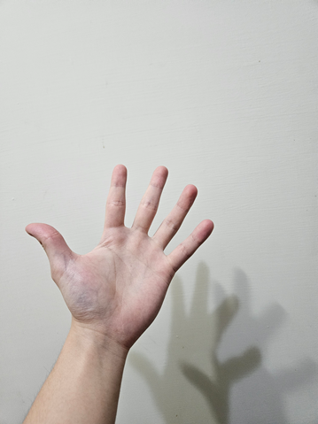
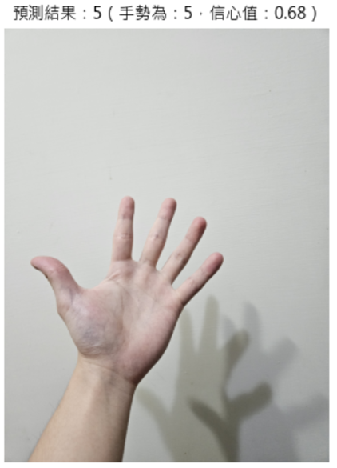
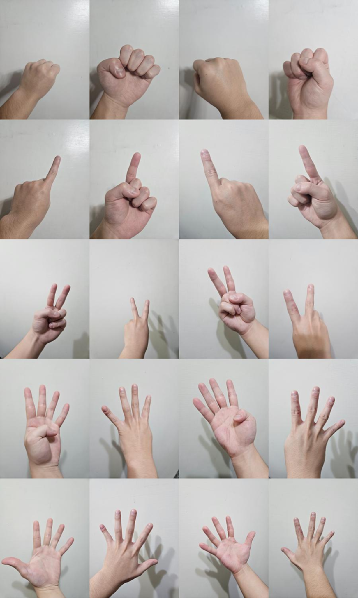
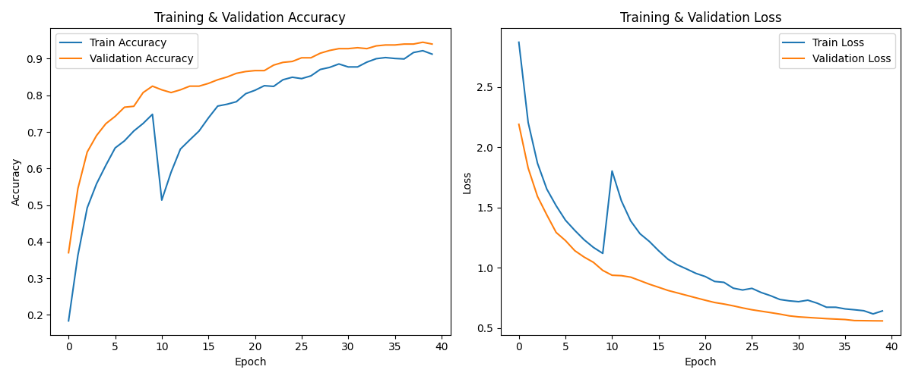

# HandGestureRecognition

A **Taiwan-style hand gesture digit recognition** system (0–9) built with **TensorFlow + MobileNetV2**.  
使用 **TensorFlow + MobileNetV2** 實作「數字手勢辨識（0~9）」：從自行拍攝資料、前處理、訓練到推論的完整流程。

---

## Overview / 專案簡介

- **Task**：影像分類（0~9 十類）
- **Model**：MobileNetV2 (ImageNet pre-trained) + Custom Classifier
- **Input**：128×128 RGB
- **Goal**：辨識台灣手勢數字 0~9（左右手、正反面）

---

## Inference Demo / 推論示範

左：輸入影像；右：模型預測結果（類別與信心值）

<p>
  
  &nbsp;&nbsp;&nbsp;
  
</p>

---

## Environment / 環境

> 本專案原本於下列環境完成訓練（可依你的設備調整）：

- WSL2 Ubuntu 22.04
- Python 3.10
- TensorFlow 2.15.0
- CUDA 12.2 + cuDNN 8.9.7 (GPU)

---

## Dataset / 資料集

本資料集為**自行拍攝**（左右手 + 正反面），分類為 **0~9** 共 10 類：

- **資料數量**：每個數字 200 張  
  - 左手正面 50、左手反面 50、右手正面 50、右手反面 50
- **圖片格式**：JPG / RGB
- **解析度**：統一調整為 128×128
- **資料分組**：以資料夾分群，例如：
  - `dataset/train/0/`, `dataset/train/1/` ... `dataset/train/9/`
- **切分方式**：80% 訓練、20% 驗證  
  - 每類：160 張 train、40 張 test  
  - 總計：1600 張 train、400 張 test

> **Note**: 由於資料集包含個人隱私且檔案體積較大，原始 `dataset/` 已加入 `.gitignore` 不上傳至 GitHub。

### Dataset Preview / 資料集示意圖

下圖為資料集示意（左右手 + 正反面） 的手勢範例，用於說明資料型態與拍攝角度分布：



---

## Data Augmentation / 數據增強

使用 `ImageDataGenerator`：

**Train**
- rescale=1./255
- rotation_range=15
- width_shift_range=0.2
- height_shift_range=0.2
- shear_range=0.05
- zoom_range=0.2
- horizontal_flip=True

**Test**
- 僅 rescale=1./255（不做增強）

---

## Model Architecture / 模型架構

使用 **MobileNetV2** 作為特徵提取器（`include_top=False`, `weights='imagenet'`）：

```text
Input (128x128x3)
   ↓
MobileNetV2 (pretrained, include_top=False)
   ↓
GlobalAveragePooling2D
   ↓
Dense(256, ReLU) + L2 regularization (l2=0.001)
   ↓
Dropout(0.5)
   ↓
Dense(10, Softmax)
   ↓
Output (classes: 0–9)
```

---


## Results / 實驗結果

訓練過程總結（Epochs: 40）：
- Accuracy: 0.9125
- Val Accuracy: 0.9400
- Loss: 0.6431
- Val Loss: 0.5602

最終表現：
- Train Accuracy: **94.19%**
- Test Accuracy: **94.00%**
- Train Loss: 0.5318
- Test Loss: 0.5602

評估指標 (Evaluation Metrics):
- Precision: 0.9478
- Recall: 0.9400
- F1-score: 0.9399

### Training Curve (Accuracy / Loss)


> 訓練曲線顯示準確率穩定提升且損失值持續下降，無明顯過擬合（Overfitting）現象。

---

## Project Structure / 專案結構

```text
HandGestureRecognition/
│
├─ assets/
│  ├─ dataset_preview.png              # 資料集示意圖（0~9、左右手、正反面）
│  ├─ training_result.png              # 訓練曲線圖表（Accuracy / Loss）
│  ├─ test_demo_5.png                  # 推論示範：輸入影像
│  └─ result_demo_5.png                # 推論示範：預測結果（類別與信心值）
│
├─ model/
│  └─ hand_gesture_model.h5            # 訓練完成的模型權重
│
├─ src/
│  ├─ hand_gesture_build_model.py      # 模型建構與訓練腳本
│  ├─ hand_gesture_predict.py          # 預測辨識腳本
│  └─ preprocess/
│     ├─ segmentation.py               # 分割資料集 (move 20% images from train to test)
│     └─ rename_images.py              # 圖片統一命名工具
│
├─ dataset/                            # (Git Ignored)
│  ├─ train/
│  │  └─ 0/ ... 9/
│  └─ test/
│     └─ 0/ ... 9/
│
└─ README.md
```

---

## How to Run

> Please run commands from the project root directory.

```bash
# Train
python src/hand_gesture_build_model.py

# Predict
python src/hand_gesture_predict.py
```


